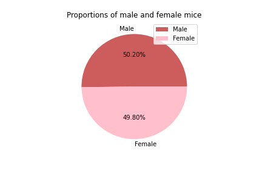

# The Power of Plots

## Background

While your data companions rushed off to jobs in finance and government, you remained adamant that science was the way for you. Staying true to your mission, you've joined Pymaceuticals Inc., a burgeoning pharmaceutical company based out of San Diego. Pymaceuticals specialises in anti-cancer pharmaceuticals. In its most recent efforts, it began screening for potential treatments for squamous cell carcinoma (SCC), a commonly occurring form of skin cancer.

As a senior data analyst at the company, you've been given access to the complete data from their most recent animal study. In this study, 249 mice identified with SCC tumour growth were treated through a variety of drug regimens. Over the course of 45 days, tumour development was observed and measured. The purpose of this study was to compare the performance of Pymaceuticals' drug of interest, Capomulin, versus the other treatment regimens. You have been tasked by the executive team to generate all of the tables and figures needed for the technical report of the study. The executive team also has asked for a top-level summary of the study results.

## Instructions

Your tasks are to do the following:

* Before beginning the analysis, check the data for any mouse ID with duplicate time points and remove any data associated with that mouse ID.

* Use the cleaned data for the remaining steps.

* Generate a summary statistics table consisting of the mean, median, variance, standard deviation, and SEM of the tumour volume for each drug regimen.

* Generate a bar plot using both Pandas's `DataFrame.plot()` and Matplotlib's `pyplot` that shows  the number of total mice for each treatment regimen throughout the course of the study.

  * **NOTE:** These plots should look identical.

* Generate a pie plot using both Pandas's `DataFrame.plot()` and Matplotlib's `pyplot` that shows the distribution of female or male mice in the study.

  * **NOTE:** These plots should look identical.

* Calculate the final tumour volume of each mouse across four of the most promising treatment regimens: Capomulin, Ramicane, Infubinol, and Ceftamin. Calculate the quartiles and IQR and quantitatively determine if there are any potential outliers across all four treatment regimens.

* Using Matplotlib, generate a box and whisker plot of the final tumour volume for all four treatment regimens and highlight any potential outliers in the plot by changing their colour and style.

* Select a mouse that was treated with Capomulin and generate a line plot of tumour volume vs. time point for that mouse.

* Generate a scatter plot of mouse weight versus average tumour volume for the Capomulin treatment regimen.

* Calculate the correlation coefficient and linear regression model between mouse weight and average tumour volume for the Capomulin treatment. Plot the linear regression model on top of the previous scatter plot.

* Look across all previously generated figures and tables and write at least three observations or inferences that can be made from the data. Include these observations at the top of notebook.

### Copyright

© 2021 Trilogy Education Services, LLC, a 2U, Inc. brand. Confidential and Proprietary. All Rights Reserved.

## **Languages used**:
- Python

## **Python Packages Used**:
- Pandas
- Scipy.stats
- Numpy
- Matplotlib

  
## **Conclusions**

From the scatter plot of weight vs average tumor volume, we can see that as weight increase, the average tumor volume increases as well. The correaltion ceoffecient value was 0.84, meaning that weight and average tumor volume are highly correlated.

For the mouse t565, we can see that as the study went on, the tumor volume drecreased to about 34 from 45. This mouse used the Capomulin treatment. (This might be the case for other mice treated with Capomulin).

From the boxplot we can see that for the treatments Ramicane and Infubinol, the data seems to be normally distributed. For the other two treatments it appears that 50% of the data is below the median value. For the Infubinol treatment there is only one outlier, while the other three treatments do not have any outliers.

From the summary statistics table we can see that Ramicane has the lowest mean and median values, suggesting that this treatment may be the most promising (40.22 and 40.67 respectivley). It also has the lowest standard error value 0.32. It is then closely followed by the Capomulin treatment.

This is almost an equal amount of male and female mice.

## **Screenshots**
## **Pandas Bar Chart**

## **MatplotLib Bar Chart**

## **Pandas Pie Chart**

## **MatplotLib Pie Chart**

## **Boxplot**

## **Line Graph**

## **Scatter Plot**

## **Regression Line**

## **Running the jupyter notebooks**
1. Before running any of the jupyter notebooks please install needed packages running the following code in the terminal.
         
        pip install pandas
        pip install matplotlib.pyplot
        pip install scipy.stats
        pip install numpy

Or run this code in the first Jupyter Notebook

        ! pip install --user pandas
        ! pip install --user matplotlib.pyplot 
        ! pip install --user scipy.stats 
        ! pip install --user numpy

2. Run the file *pymaceuticals.ipynb* 

